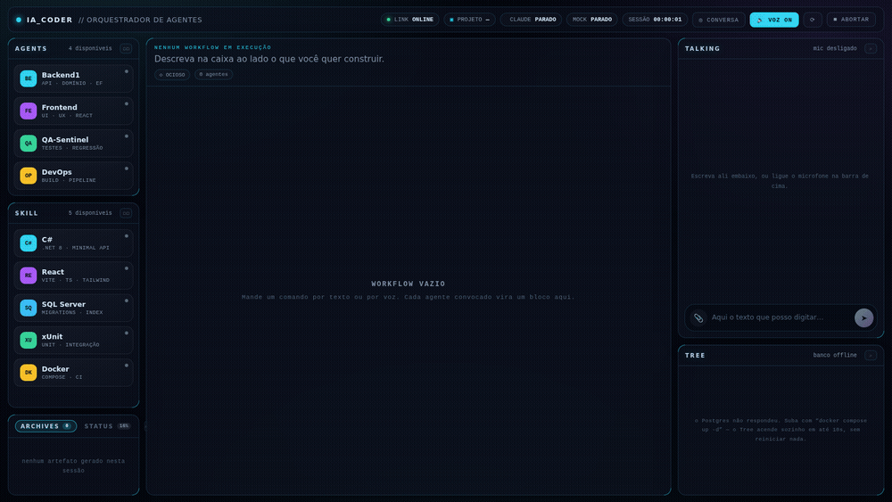

# IA_Coder

Orquestrador visual de agentes de IA. A ferramenta sempre trabalha em formato **WORKFLOW**:
cada agente vira um bloco, cada bloco mostra qual skill está sendo usada e o que está sendo
feito naquele instante — com setas animadas ligando `Agente → Bloco` e `Agente → Skill`.

Você conversa em português, por texto, voz ou imagem, com o painel **Talking**: ele entende
o pedido, propõe um plano e só mexe em código depois do seu "pode ir" — aí vira um workflow
de verdade, com os agentes trabalhando em paralelo na tela.

## Demo



*(gravado com o roteiro de ensaio — `npm run mock` em `apps/web`, sem gastar token nenhum; veja [“Ver a tela viva sem gastar nada”](#rodando).)*

## Estrutura

```
IA_Coder/
├── apps/
│   ├── server/             # servidor local: WebSocket + PowerShell + Claude Code
│   │   └── src/
│   │       ├── index.ts        # laço principal: comandos do cliente, workflow, heartbeat
│   │       ├── orchestrator.ts # dono dos agentes/blocos/setas de um workflow
│   │       ├── discovery.ts    # varre o disco: agentes e skills instalados
│   │       ├── conversation.ts # o "Talking": chat → plano → confirmação
│   │       ├── claude.ts       # processo `claude` persistente (stream-json)
│   │       ├── mcp.ts          # servidores MCP: quem está de pé, quem precisa de login
│   │       ├── usage.ts        # consumo real da conta (janela de 5h + limite semanal)
│   │       └── protocol.ts     # tipos dos eventos WebSocket (fonte da verdade)
│   └── web/                # frontend (React + TypeScript + Vite + CSS Modules)
│       ├── src/components/     # painéis: Talking, Agents, Skills, Tree, Status, Working…
│       ├── src/store/          # Zustand — um único useSession alimentado pelo servidor
│       └── tools/mock-server.mjs # servidor de ensaio, mesmo protocolo, roteiro fixo
├── db/init/                # esquema do Postgres, aplicado no primeiro boot
├── db/migrations/          # alterações para bancos que já existem
├── docs/
│   ├── ESTADO.md           # onde o projeto parou e como retomar  ← comece aqui
│   ├── PROTOCOLO.md        # contrato de eventos WebSocket entre web e server
│   ├── DOCKER.md           # infraestrutura local e por que ela é assim
│   └── demo.gif            # a demonstração acima
├── scripts/infra.ps1       # atalhos do compose no Windows (PowerShell)
├── scripts/infra.sh        # os mesmos atalhos no WSL, + reset-db
├── workspace/artifacts/    # artefatos gerados pelos agentes (painel Archives)
├── docker-compose.yml
├── LICENSE
└── README.md
```


> **Voltando depois de um tempo?** [docs/ESTADO.md](docs/ESTADO.md) diz onde o
> projeto parou, o que já foi verificado, o que falta testar e as decisões que
> não são óbvias.

## Como funciona

1. **Talking é a única porta de entrada.** Escreve ou fala no painel da direita — dá pra
   colar ou anexar imagem junto. O agente conversa, e se entender o pedido, devolve um
   plano (título, passos, risco) e pergunta "posso ir?".
2. **Nada é executado durante a conversa.** Ele lê e investiga o projeto à vontade para
   responder bem, mas só edita arquivo ou roda comando depois da sua confirmação
   (clicando em **Pode ir** ou respondendo "pode mandar", por texto ou voz).
3. **Confirmou → vira workflow.** Cada agente relevante (Backend, Frontend, QA, DevOps…)
   ganha um bloco na tela, mostrando a skill em uso e os arquivos que ele produz, com
   setas animadas ligando `Agente → Bloco` e `Agente → Skill` (o componente `WireLayer`).
4. **Ele narra enquanto trabalha:** avisa ao começar, dá sinal de vida periodicamente e
   lê o resumo no final — o resumo e os arquivos gerados ficam encostados na própria
   conversa do Talking, sem painel separado.
5. **O que funcionou uma vez fica guardado.** Confirmando "Guardar no Tree", a análise
   vira um assunto reutilizável (resumo + stack) no painel **Tree** — na próxima vez que
   algo parecido aparecer, o agente já começa sabendo, em vez de investigar tudo de novo.
6. **Os painéis Agents e Skill mostram o que está instalado de verdade.** O servidor
   varre os plugins do Claude Code, o `.claude` do projeto e o seu — se você instalou
   um plugin com dezesseis agentes, os dezesseis aparecem ali, e o que o Claude usa
   durante a execução acende no próprio cartão.
7. **O painel Status mostra o consumo real da sua conta** Claude (janela de 5 horas e
   limite semanal), não um contador por sessão.
8. **Os servidores MCP que você já usa no Claude Code valem aqui também.** O chip
   `MCP` na barra de cima mostra quantos estão de pé; clicando, você vê a lista e
   entra nos que pedem credencial — o `claude mcp login` roda no PowerShell que já
   está aberto, o endereço de autorização aparece clicável no próprio popup, e
   depois de aprovar o agente reinicia sozinho já enxergando as ferramentas. Se
   uma ferramenta for barrada no meio de uma resposta, o popup abre sozinho
   apontando o servidor que faltou.

   > O agente roda em modo não interativo, onde não existe prompt de permissão.
   > Por isso o padrão é `CLAUDE_PERMISSION_MODE=auto`: `acceptEdits` libera
   > edição de arquivo e **não** libera ferramenta de MCP — o servidor aparece
   > conectado e toda chamada volta "bloqueada". Se o seu `.env` fixar
   > `acceptEdits`, o popup avisa em vez de deixar você tentando logar num
   > servidor onde já está dentro.

Todo o contrato de eventos entre a interface e o servidor está documentado em
[docs/PROTOCOLO.md](docs/PROTOCOLO.md); o frontend **não inventa dado nenhum** — tudo que
aparece na tela chegou por um evento do servidor.

## Infraestrutura

```powershell
copy .env.example .env      # troque POSTGRES_PASSWORD
docker compose up -d        # postgres (pgvector) + redis
```

Detalhes, perfis opcionais e as decisões por trás disso: [docs/DOCKER.md](docs/DOCKER.md).
O servidor roda **no Windows**, fora do Docker — ele precisa do PowerShell e dos seus
repositórios. Não sobe Adminer: quem quiser olhar o banco aponta um cliente próprio
(DBeaver, por exemplo) para `localhost:5433` com o usuário/senha do `.env`.

## Rodando

Três terminais:

```powershell
# 1) infraestrutura
docker compose up -d

# 2) servidor local
cd apps\server
npm install
npm run dev

# 3) interface
cd apps\web
npm install
npm run dev
```

Abre em http://localhost:5173, no Chrome ou Edge (a voz usa a Web Speech API).

Ao abrir a página, o servidor já sobe **em background**, dentro da pasta do projeto:
um PowerShell escondido e um processo do Claude Code esperando o primeiro pedido.
O botão **PROJETO** na barra de cima troca a pasta — a escolha fica salva em
`workspace/prefs.json` e vale nas próximas aberturas.

### Talking: texto, voz e imagem

O painel **Talking** aceita digitar, colar/anexar imagem, ou — ligando o botão **VOZ**
na barra de cima — falar. Com voz:

```powershell
docker compose --profile voice up -d
```

Isso sobe Whisper (fala → texto) e Piper (texto → fala) locais. Sem esses containers, o
modo voz cai para o reconhecimento e a síntese do navegador: pior, mas funciona.

Ligar/desligar o microfone **não** afeta a caixa de texto — ela funciona sempre, ligado
ou não. Fale ou escreva **"IA Coder"** (ou "Jarvis") para o modo mãos-livres te ouvir.

Sem o servidor, a interface abre e mostra **OFFLINE** na topbar, reconectando sozinha.
Nada é simulado. Para ver a tela viva sem gastar nada — inclusive para gravar a demo
acima — use:

```powershell
cd apps\web
npm run mock       # sobe um servidor de ensaio em ws://localhost:8787/ws
npm run dev        # em outro terminal, a interface de verdade
```

## Decisões de arquitetura

| Tema | Escolha |
|---|---|
| Runtime | Web app + servidor Node local (empacotável em Electron depois) |
| Estado | Zustand — um único `useSession` alimentado por eventos do servidor |
| Transporte | WebSocket com reconexão exponencial e fila de comandos |
| Estilo | CSS Modules + design tokens (`src/styles/tokens.css`) |
| Persistência | Postgres 17 + pgvector — estado, replay e embeddings do Tree |
| Mensageria | Redis — pub/sub dos eventos e fila de trabalho dos agentes |
| Embeddings | Ollama local (`nomic-embed-text`, 768d), opcional |
| Voz | Web Speech API — `SpeechRecognition` (entrada) e `speechSynthesis` (resposta) |
| Motor | Um processo `claude` persistente (`--input-format stream-json`) por projeto |
| Memória | Tree de dois níveis (assunto → stack) no Postgres, injetado como contexto |
| Voz | Whisper + Piper locais (perfil `voice` do compose), com queda para o navegador |
| Setas | `WireLayer`: SVG global que resolve posições via registro de âncoras (`AnchorContext`) |
| Consumo | Painel Status lê a API de conta da Anthropic (`/api/oauth/usage`, token do Claude Code) — 5h + semanal, da conta inteira, não da sessão |

O frontend **não inventa dados**. Tudo que aparece na tela chega por evento do servidor.

## Licença

Este projeto está sob a licença MIT — veja [LICENSE](LICENSE). Desenvolvido por
**Émerson Schulze**.
